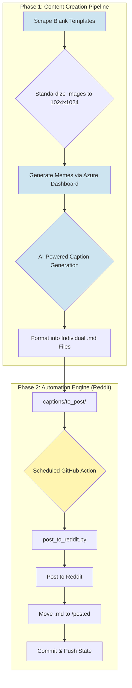

# 🤖 AI Literacy Reddit Bot

This repository houses a sophisticated, end-to-end system for creating and publishing educational AI-themed memes to Reddit. It's a complete content creation and management pipeline designed to make learning about Artificial Intelligence accessible and fun, now adapted for the Reddit platform.

**The Mission:** To spread AI literacy in an engaging, humorous, and digestible format, leveraging the power of automation to manage the entire posting process.

---

## 🏛️ Architecture & Strategy

This project uses a fully serverless architecture built on GitHub Actions. The entire workflow logic is contained within Python scripts that execute directly within a temporary environment spun up by GitHub Actions.

*   **No Local Dependency:** The automation is entirely independent of any local machine or server.
*   **High Reliability:** GitHub's infrastructure handles the execution environment, scheduling, and retries.
*   **Cost-Effective:** Resources are only consumed for the few seconds the workflow runs.
*   **Secure:** Credentials are managed using encrypted GitHub Secrets and are never exposed in the code.

---

## ✨ Key Features

*   **Fully Automated Posting:** Runs on a CRON schedule using GitHub Actions to post content without any manual effort.
*   **Self-Managed Git Repository:** After posting, the bot automatically moves the used caption file to an archive directory and commits the change, keeping the repository state perfectly in sync with the Reddit posts.
*   **Proactive Low-Content Alerts:** A separate workflow monitors the content queue and sends an email alert if the number of pending posts falls below a defined threshold.
*   **Emergency "Undo" Functionality:** A manually-triggered workflow that can delete the most recent post on Reddit and simultaneously move its content file back into the posting queue.

---

## 🌊 The End-to-End Workflow

The project is divided into two main phases: the **Content Creation Pipeline** (the human-in-the-loop process for generating content) and the **Automation Engine** (the fully autonomous system for publishing it).

*(Note: This diagram uses Mermaid syntax and is rendered natively by GitHub.)*

The **Content Creation Pipeline** remains the same, focusing on generating high-quality memes and corresponding caption files. The **Automation Engine** has been migrated to work seamlessly with the Reddit API.

---

## 🚀 Setup Instructions

To get this automation running in your own repository, follow these steps:

#### 1. Fork the Repository
Click the **"Fork"** button at the top-right of this page to create a copy of this repository in your own GitHub account.

#### 2. Add Your Content
*   Place your meme images (e.g., `.jpg`, `.png`) inside the `memes/` directory.
*   Create corresponding caption files inside the `captions/to_post/` directory.
*   **Crucially, the filenames must match.** For `my-meme.jpg`, you must have a `my-meme.md` file. The bot will use the filename to generate the post title and the file's content as a comment.

#### 3. Configure GitHub Secrets
The automation needs your Reddit API credentials to post on your behalf. These should be stored securely as GitHub Secrets.

First, follow the instructions in **[REDDIT_APP_GUIDE.md](REDDIT_APP_GUIDE.md)** to get your API credentials from the Reddit website.

Once you have your credentials, go to **Settings > Secrets and variables > Actions** in your forked repository and add the following secrets:

*   `REDDIT_CLIENT_ID`: Your app's client ID.
*   `REDDIT_CLIENT_SECRET`: Your app's client secret.
*   `REDDIT_USER_AGENT`: A descriptive user-agent string (e.g., `python:my-meme-poster:v1.0 (by /u/your_username)`).
*   `REDDIT_USERNAME`: The Reddit username you are posting from.
*   `REDDIT_PASSWORD`: The password for that Reddit account.
*   `SUBREDDIT`: The name of the subreddit you want to post to (e.g., `learnmachinelearning`, `memes`).

#### 4. Enable Workflows
By default, GitHub disables Actions on forked repositories for security reasons.
1.  Go to the **"Actions"** tab in your repository.
2.  Click the **"I understand my workflows, go ahead and enable them"** button.

That's it! The bot is now live and will run on the schedules defined in the `.github/workflows/` files.

---

## 🛠️ Technology & Tools

*   **Languages:** Python
*   **Cloud & AI:** Microsoft Azure (for the generation dashboard and AI services)
*   **Automation:** GitHub Actions
*   **APIs & Libraries:** `praw` (Python Reddit API Wrapper)
*   **Developer Experience:** GitHub Copilot, Gemini CLI
