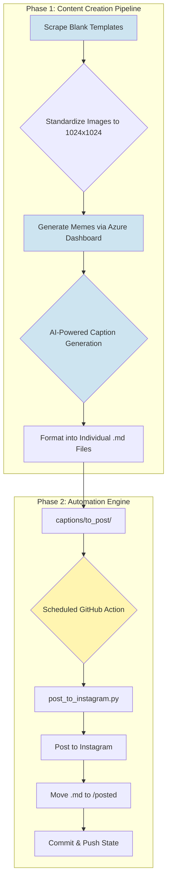

# 🤖 AI Literacy Instagram Bot

This repository houses a sophisticated, end-to-end system for creating and publishing educational AI-themed memes to Instagram. It's more than just a posting bot; it's a complete content creation and management pipeline designed to make learning about Artificial Intelligence accessible and fun.

**The Mission:** To spread AI literacy in an engaging, humorous, and digestible format, leveraging the power of automation and AI itself to manage the entire process.

---

## 🏛️ Evolution of the Architecture & Strategy

The project evolved through several strategic phases to achieve its current robust and fully serverless state.

### Phase 1: Initial Local Setup (Proposed)
*   **Concept:** The initial idea was to use GitHub Actions merely as a trigger. A webhook would activate a locally running `n8n` Docker container, which would then execute the posting logic.
*   **Limitations:** This approach created a fragile dependency on a local machine. It required the Docker instance to be running 24/7, a stable internet connection, and manual maintenance. If the local environment failed, the entire automation would halt.

### Phase 2: Fully Serverless with GitHub Actions (Current Implementation)
*   **Concept:** The architecture was re-engineered to be completely serverless. The entire workflow logic was moved into Python scripts that execute directly within a temporary environment spun up by GitHub Actions.
*   **Benefits:**
    *   **No Local Dependency:** The automation is entirely independent of any local machine or server.
    *   **High Reliability:** GitHub's infrastructure handles the execution environment, scheduling, and retries, ensuring consistent operation.
    *   **Cost-Effective:** Resources are only consumed for the few seconds the workflow runs, making it virtually free.
    *   **Secure:** Credentials are managed using encrypted GitHub Secrets, never exposed in code or stored locally.

---

## ✨ Key Features & Execution Strategies

*   **Intelligent Alt Text Generation:** The system automatically parses Markdown caption files, extracting a specific section to be used as accessibility alt-text, making posts more inclusive for visually impaired users.
*   **Fully Automated Posting:** Runs on a CRON schedule using GitHub Actions to post content without any manual effort.
*   **Self-Managed Git Repository:** After posting, the bot automatically moves the used caption file to an archive directory and commits the change, keeping the repository state perfectly in sync with the Instagram profile.
*   **Proactive Low-Content Alerts:** A separate workflow monitors the content queue and sends an email alert if the number of pending posts falls below a defined threshold.
*   **Emergency "Undo" Functionality:** A manually-triggered workflow that can archive the most recent post on Instagram and simultaneously move its content file back into the posting queue.

---

## 🌊 The End-to-End Workflow

The project is divided into two main phases: the **Content Creation Pipeline** (a human-in-the-loop process for generating content) and the **Automation Engine** (a fully autonomous system for publishing it).

*(Note: This diagram uses Mermaid syntax and is rendered natively by GitHub.)*

### Phase 1: The Content Creation Pipeline

This is where the magic begins. Before any automation can run, the content itself must be thoughtfully created. This process was designed to be efficient and scalable.

#### 1. Ethical Template Sourcing
Blank meme templates were ethically sourced from public resources like Reddit and free APIs using a custom Python script.

#### 2. Image Standardization
A strict quality-control criterion was applied: all templates were programmatically processed and standardized to a `1024x1024` resolution, ensuring they are perfectly optimized for the Instagram feed.

#### 3. The Azure-Powered Meme Generator
Leveraging free credits from **Microsoft Azure**, a private web dashboard was created to streamline meme generation:
*   **Display & Decide:** The dashboard displayed a blank template.
*   **AI-Powered Suggestions:** It generated potential meme text based on a predefined list of AI topics (e.g., "Neural Networks," "Overfitting," "LLMs").
*   **Human-in-the-Loop:** I had full control to reposition text boxes or refresh the content until the joke landed perfectly.
*   **Finalize & Download:** Once satisfied, the final meme was generated and downloaded locally into the project structure. This process was repeated for all templates.

#### 4. AI-Driven Caption Generation
To ensure captions were human-like, context-aware, and perfectly formatted, a dedicated AI pipeline was built:
1.  **Image Analysis:** The final meme image was analyzed by an AI model (utilizing Azure AI services) to understand its content, text, and humor.
2.  **Guided Generation:** The model generated a detailed caption strictly following a `prompt.txt` file. This prompt engineering ensured consistency in tone, structure (including the "For those who don't get it" section), and hashtag usage.
3.  **Bulk Creation:** The output was a single, master `captions.md` file, which was then programmatically split into individual Markdown files, one for each meme.

---

## 🚀 Setup Instructions (for a new user)

To get this automation running in your own repository, follow these steps:

#### 1. Fork the Repository
Click the **"Fork"** button at the top-right of this page to create a copy of this repository in your own GitHub account.

#### 2. Add Your Content
*   Place your meme images (e.g., `.jpg`, `.png`) inside the `memes/` directory.
*   Create corresponding caption files inside the `captions/to_post/` directory.
*   **Crucially, the filenames must match.** For `my-meme.jpg`, you must have a `my-meme.md` file.

#### 3. Configure GitHub Secrets
The automation needs your Instagram credentials to post on your behalf. These should be stored securely as GitHub Secrets.
1.  In your forked repository, go to **Settings > Secrets and variables > Actions**.
2.  Click **"New repository secret"** for each of the following:
    *   `INSTAGRAM_USERNAME`: Your Instagram username.
    *   `INSTAGRAM_PASSWORD`: Your Instagram password.

#### 4. Enable Workflows
By default, GitHub disables Actions on forked repositories for security reasons.
1.  Go to the **"Actions"** tab in your repository.
2.  You will see a banner that says "Workflows aren't running on this forked repository." Click the **"I understand my workflows, go ahead and enable them"** button.

That's it! The bot is now live and will run on the schedules defined in the `.github/workflows/` files. You can customize the `cron` schedules in `main-workflow.yml` and `check-post-queue.yml` to fit your needs.

---

## 🛠️ Technology & Tools

*   **Languages:** Python
*   **Cloud & AI:** Microsoft Azure (for the generation dashboard and AI services)
*   **Automation:** GitHub Actions
*   **APIs & Libraries:** `instagrapi`
*   **Developer Experience:** GitHub Copilot, Gemini CLI (for assistance during design and implementation)

---

## 🔮 Future Vision & Project Assets

*   **Upcoming Assets:** I will soon upload the `prompt.txt` file, the list of AI topics, and a selection of blank meme templates to this repository to provide a complete picture of the content generation pipeline.
*   **Future Scope:**
    *   **Multi-Platform Expansion:** Adapt the posting module to support other platforms like Twitter or LinkedIn.
    *   **Video & Reel Support:** Enhance the automation to handle `.mp4` video files and Instagram Reels.
    *   **Interactive Content Generation:** Create a public-facing web interface (using Streamlit or Flask) that allows others to contribute by generating memes.
